# 🛡️ Awesome Endpoint Detection and Response (EDR)

  

**Curated List of Commercial Enterprise SaaS Platforms & Open-Source GitHub EDR Projects**

*Focused on Endpoint Detection, Response Automation, Incident Response, Threat Hunting & Ransomware Protection*

**Last updated: October 2026**

---

## 🔍 Overview & SEO Guide

Welcome to the **Awesome Endpoint Detection and Response (EDR)** repository! Endpoint Detection and Response (EDR) forms the cornerstone of modern Security Operations Centers (SOC) and enterprise cyber defense. EDR platforms continuously monitor end-user devices (workstations, servers, Linux nodes, and cloud workloads) to detect, investigate, and mitigate advanced threats such as ransomware, fileless malware, zero-day exploits, lateral movement, and credential dumping aligned with the **MITRE ATT&CK® framework**.

This curated list aggregates both enterprise **SaaS EDR/XDR platforms** and cutting-edge **open-source EDR solutions**. Whether you are evaluating commercial tools like CrowdStrike Falcon and Microsoft Defender P2, or deploying self-hostable open-source telemetry agents like Osquery, Wazuh, or Warden, this guide provides complete feature breakdowns and market pricing context.

---

## 📖 Table of Contents

- [☁️ SaaS/Hosted Platforms](#️-saashosted-platforms)
- [🔓 Open-Source EDR GitHub Projects](#-open-source-edr-github-projects)
- [🤝 How to Contribute](#-how-to-contribute)
- [⚠️ Disclaimer](#️-disclaimer)
- [📈 Star History](#-star-history)
- [💖 Support & Community](#-support--community)

---

## ☁️ SaaS/Hosted Platforms

> **📊 Market Context**: The global EDR market is estimated at **~$8B in 2026**, growing toward **~$20B by 2032**. The sector is **moderately concentrated** — **CrowdStrike Falcon** leads with **22.68% market share** (13,432 customers), followed by **Microsoft Defender for Endpoint** at **15.61%** and **SentinelOne** at **11.52%**. **Pricing varies dramatically**: CrowdStrike benchmarks at **$92/endpoint/year** for 1,000–2,499 endpoints (dropping to **$54** at 75,000+), while SentinelOne runs **10–18% below** CrowdStrike at equivalent tiers. **Microsoft Defender P2 is bundled with M365 E5**, with an allocated benchmark cost of **$42–$58/endpoint/year**—making it the most cost-effective option for Microsoft-centric organizations. No single vendor holds a winner-take-all position; enterprises typically run multi-vendor stacks.

| Platform | Description | Pricing (Starting Tier) | Free Tier Limits | Company Size |
|----------|-------------|------------------------|------------------|--------------|
| **[Microsoft Defender for Endpoint](https://www.microsoft.com/en-us/security/business/endpoint-security/microsoft-defender-endpoint)** | **Microsoft's native EDR.** Deep integration with Defender XDR, Intune, and Entra ID. **16% market share**. | **Included in Microsoft 365 E5** (marginal cost $0). **Standalone**: ~$4/user/month (Plan 2). **Allocated benchmark cost**: **$42–$58/endpoint/year**. | **No perpetual free tier**. **Microsoft 365 E5 trial** available (30 days). | **~$281B revenue (Microsoft FY2025)** |
| **[CrowdStrike Falcon](https://www.crowdstrike.com/)** | **The EDR market leader.** Cloud-native platform with threat intelligence, OverWatch managed hunting, and 23+ modules. **22.68% market share**, 13,432 customers. | **Falcon Enterprise**: **$92/endpoint/year** (1K–2.5K endpoints), **$54** (75K+). **~$8.99/endpoint/month**. **Premium pricing, maximum negotiability**. | **No free tier**. **15-day free trial** available. | **~$4B revenue (FY2025)**, ~$16B market cap |
| **[SentinelOne Singularity](https://www.sentinelone.com/)** | **Autonomous AI-powered EDR.** On-device AI with **ransomware rollback**—the strongest in the category. **11.52% market share**. | **Singularity Complete**: **$80/endpoint/year** (1K–2.5K), **$44** (75K+). **~$6/endpoint/month**. **10–18% below CrowdStrike** at equivalent tiers. | **No free tier**. **Free trial** available. | **$821.5M revenue (FY2025)** |
| **[VMware Carbon Black](https://www.vmware.com/products/carbon-black-cloud.html)** | **Broadcom-owned EDR.** Behavioral visibility and VMware integration. Commercial uncertainty post-Broadcom acquisition. | **Custom enterprise pricing**—quote required. Pricing moved upward for mid-market (5K–25K endpoints) while remaining competitive for large enterprise (100K+). | **No free tier**. **Free trial** available. | **$209.7M revenue (FY2018)** |
| **[Trend Micro Vision One](https://www.trendmicro.com/)** | **XDR platform with EDR.** Broad visibility across email, endpoint, cloud, and network. | **Custom enterprise pricing**—quote required. List prices lower than CrowdStrike/Trellix, less room to compress. | **No free tier**. **Free trial** available. | **~$1.8B revenue (Trend Micro FY2025)** |
| **[Sophos Intercept X](https://www.sophos.com/)** | **SMB-focused EDR with XDR.** Strong cloud visibility ratings (91% data discovery, 92% cloud registry). | **Custom pricing**—quote required. | **Free trial** available. | **Private (~$700M+ revenue est.)** |
| **[Cybereason](https://www.cybereason.com/)** | **Defense-focused EDR.** Behavioral detection with attack timeline visualization. | **Custom enterprise pricing**—quote required. | **Free trial** available. | **Private (~$2.7B valuation est.)** |
| **[Cynet 360](https://www.cynet.com/)** | **Autonomous breach protection.** EDR + NDR + UEBA in one platform. | **Custom pricing**—quote required. | **Free trial** available. | **Private (~$100M+ raised)** |
| **[Palo Alto Cortex XDR](https://www.paloaltonetworks.com/cortex/cortex-xdr)** | **Palo Alto's XDR platform.** EDR + network + cloud telemetry correlation. | **Custom enterprise pricing**—quote required. | **Free trial** available. | **~$9.2B revenue (Palo Alto FY2025)** |
| **[Broadcom Symantec EDR](https://www.broadcom.com/)** | **Symantec's EDR.** Integrated with Broadcom's security portfolio. | **Custom enterprise pricing**—quote required. | **Free trial** available. | **~$51B revenue (Broadcom FY2025 est.)** |

---

## 🔓 Open-Source EDR GitHub Projects

> **💡 Open-Source Ecosystem**: The open-source EDR ecosystem is emerging rapidly, ranging from SQL-powered OS instrumentation (`Osquery`, `Fleet`) and full open SIEM/EDR stacks (`Wazuh`) to specialized Rust & eBPF sensors (`Warden`, `Radegast EDR`) and autonomous AI-triage engines (`AEGIS`).

*Projects below are sorted by GitHub Star count in descending order.*

| Repo | Description | Stars |
|------|-------------|-------|
| **[Osquery](https://github.com/osquery/osquery)** | **SQL-powered operating system instrumentation & telemetry.** Exposes an OS as a high-performance relational database. Allows security engineers to write SQL queries to inspect process tables, active network sockets, loaded kernel modules, and system configurations across Windows, macOS, and Linux. |  |
| **[Wazuh](https://github.com/wazuh/wazuh)** | **Unified open-source security platform with full EDR & SIEM capabilities.** Performs log analysis, file integrity monitoring (FIM), vulnerability detection, threat hunting, and automated incident response actions across endpoints and cloud workloads. |  |
| **[GRR Rapid Response](https://github.com/google/grr)** | **Google's open-source remote live forensics & incident response framework.** Designed for rapid scalable endpoint investigation, allowing incident responders to collect volatile memory, execute live remote forensic queries, and analyze endpoints across enterprise networks. |  |
| **[Fleet](https://github.com/fleetdm/fleet)** | **Open-source endpoint management & osquery manager.** Provides centralized fleet control, real-time vulnerability management, compliance automation, and lightweight EDR telemetry querying across Linux, macOS, and Windows devices. |  |
| **[Velociraptor](https://github.com/Velocidex/velociraptor)** | **Advanced endpoint visibility, live forensics, and incident response platform.** Uses Velociraptor Query Language (VQL) to hunt for threat artifacts, inspect kernel memory, collect forensic evidence, and automate active endpoint isolation. |  |
| **[CAPEv2](https://github.com/CAPEv2/CAPEv2)** | **Open-source malware analysis sandbox & threat extraction framework.** Used alongside EDR pipelines to automatically execute payloads, extract C2 indicators of compromise (IOCs), parse malware configuration data, and generate EDR detection rules. |  |
| **[Warden](https://github.com/Spellskite-coding/Warden)** | **Open-source EDR for Linux Workstations written in Rust.** Features YARA scanning, ransomware fanotify monitors, quarantine with setuid-stripping, detection history, SHA-256 exceptions, and a GTK4/libadwaita dashboard. Hardened through adversarial testing and systemd sandboxing (`ProtectSystem=strict`). |  |
| **[Kizashi](https://github.com/kizashi-labs/kizashi)** | **Self-hostable open-source EDR for Windows endpoints (AGPL-3.0).** ETW sensor capturing process, network, registry, DNS, WMI, and PowerShell events. Network isolation via console (`POST /agents/:id/isolate`) over NATS JetStream, with rule-driven auto-remediation. Zero outbound telemetry by default. |  |
| **[AEGIS](https://github.com/alejadxr/AEGIS)** | **Open-source autonomous cybersecurity platform with 11/11 detection score.** Sub-300ms response pipeline, honeypot deception, breadcrumb traps, AI-powered triage, and Rust agent. 12 Sigma rules cover complete ransomware kill-chain (VSS delete, shadow copy inhibition, entropy spikes, certutil LOLBins). |  |
| **[Radegast EDR](https://github.com/radegast-edr/radegast-backend)** | **Lightweight, privacy-respecting EDR platform with end-to-end encryption.** age encryption for log data—server cannot read logs even if compromised. Features Rustinel eBPF sensor for Linux and Windows, built-in SQLite DB, device management, and single-command Docker deployment. |  |

---

## 🤝 How to Contribute

Contributions are welcome! Follow these quick steps to submit new EDR tools, open-source projects, or benchmark updates:

1. 🍴 **Fork the repository**.
2. 📝 **Add or update entries in `README.md`** (following the established table format).
3. 🔗 **Include details**: Name, homepage/GitHub link, 1–2 sentence description, star badge (if open-source), and pricing tier (if SaaS).
4. 🚀 **Submit a Pull Request (PR)** with a concise summary of changes.

---

## ⚠️ Disclaimer

- This repository is a **community-curated list** — it is not exhaustive and does not constitute an endorsement of any vendor or tool.
- EDR platforms handle sensitive system telemetry, memory dumps, and security event logs. Ensure proper role-based access control (RBAC) and compliance with organizational security requirements when deploying any platform.
- **Open-source vs Enterprise**: Open-source solutions (`Wazuh`, `Velociraptor`, `Warden`, `Kizashi`) offer complete control, customization, and privacy. However, commercial SaaS vendors (`CrowdStrike`, `Microsoft Defender`, `SentinelOne`) deliver global cloud threat intelligence feeds, continuous 24/7 managed hunting (MDR), and enterprise SLA guarantees that open-source alternatives cannot replicate alone.
- **Pricing notice**: Pricing data is collected from public benchmarks and vendor disclosures as of late 2026. Commercial pricing varies based on volume discounts, licensing agreements, and promotional incentives. Always request formal quotes from vendors.

---

## 📈 Star History

---

## 💖 Support & Community

Thank you for exploring **Awesome Endpoint Detection and Response (EDR)**! If you find this repository valuable for your security research, SOC operations, or endpoint security architecture, please consider supporting:

- ⭐ **Star this repository** to help fellow security professionals find it.
- 🔀 **Fork & Contribute** new EDR software, research links, or open-source agents.
- 📢 **Share** with your network, cybersecurity teams, and threat hunting forums.
- ☕ **Sponsor / Buy Me a Coffee**: Support ongoing open-source curation on the [GitHub Sponsor Dashboard](https://github.com/sponsors/ishandutta2007).
